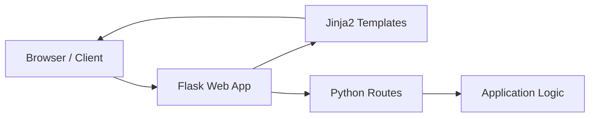

---

# Student Contribution

## Developer Information

| Campo | Valor |
|-------|-------|
| Names | Princes Rocio Guerrero Sánchez|
| University | Universidad Tecnologica del Norte de Guanajuato |
| Date | 2026-06-01 |

## Proposed Improvements

1. Ampliar la sección de ejemplos con casos de uso reales.
2. Agregar guías de instalación para distintos sistemas operativos.
3. Incluir una sección de preguntas frecuentes (FAQ).

## Observations

Simple WebApp Flask es una aplicación web básica desarrollada con Python y Flask. Su estructura sencilla la hace ideal para aprender despliegue de aplicaciones web y prácticas de DevOps.

---

## Project Strengths

1. **Simplicidad**: Código mínimo y fácil de entender para desarrolladores nuevos.
2. **Flask como base**: Usa uno de los frameworks Python más populares y documentados.
3. **Ideal para DevOps**: Perfecto para practicar CI/CD, Docker y Kubernetes.
4. **Rápida instalación**: Se puede ejecutar en minutos sin configuración compleja.
5. **Open Source**: Cualquier desarrollador puede contribuir y mejorar el proyecto.

---

## Improvement Opportunities

1. **Agregar autenticación**: No tiene sistema de login ni manejo de sesiones.
2. **Base de datos**: Actualmente no persiste datos, podría integrarse con SQLite o PostgreSQL.
3. **Tests automatizados**: No incluye pruebas unitarias ni de integración.
4. **Dockerización**: Podría incluir un Dockerfile listo para usar.
5. **Documentación de API**: No documenta los endpoints disponibles.

---

## Technologies Used

| Technology | Version | Purpose              |
| ---------- | ------- | -------------------- |
| Python     | 3.x     | Programming Language |
| Flask      | 2.x     | Web Framework        |
| HTML       | 5       | Frontend Structure   |
| CSS        | 3       | Frontend Styling     |
| Jinja2     | Latest  | Template Engine      |
| Gunicorn   | Latest  | WSGI HTTP Server     |
| Docker     | Latest  | Containerization     |
| Git        | Latest  | Version Control      |

---

## Architecture Diagram

---

## Functional Requirements

| ID    | Requirement                                                   |
| ----- | ------------------------------------------------------------- |
| RF-01 | The system shall display a welcome page to the user.          |
| RF-02 | The system shall support HTTP GET requests on the main route. |
| RF-03 | The system shall render dynamic HTML using Jinja2 templates.  |
| RF-04 | The system shall return appropriate HTTP status codes.        |
| RF-05 | The system shall be deployable in a Docker container.         |
| RF-06 | The system shall run on Python 3.x environments.              |
| RF-07 | The system shall support multiple routes for different pages. |
| RF-08 | The system shall handle 404 errors with a custom error page.  |
| RF-09 | The system shall be configurable via environment variables.   |
| RF-10 | The system shall serve static files such as CSS and images.   |

---

## Team Members

| Name                           | Role                      |
| ------------------------------ | ------------------------- |
| Princes Rocio Guerrero Sánchez | Developer & Documentation |
