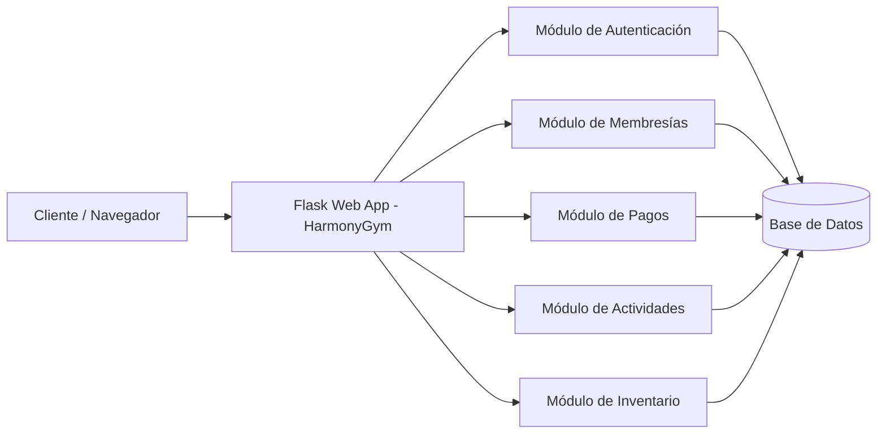

---

# Student Contribution

## Developer Information

| Campo | Valor |
|-------|-------|
| Names | Princes Rocio Guerrero Sánchez|
| University | Universidad Tecnologica del Norte de Guanajuato |
| Date | 2026-06-01 |

## Proposed Improvements

1. Ampliar la sección de ejemplos con casos de uso reales.
2. Agregar guías de instalación para distintos sistemas operativos.
3. Incluir una sección de preguntas frecuentes (FAQ).

## Observations

Simple WebApp Flask es una aplicación web básica desarrollada con Python y Flask. Su estructura sencilla la hace ideal para aprender despliegue de aplicaciones web y prácticas de DevOps.

---

---

## Project Strengths

1. **Gestión centralizada**: Unifica clientes, membresías, pagos, actividades e inventario en un solo sistema.
2. **Seguridad robusta**: Autenticación por roles (administrador, recepcionista, instructor, cliente) con cifrado de datos.
3. **Alertas automáticas**: Notificaciones de vencimiento de membresía, recordatorios de pago y confirmación de clases.
4. **Multiplataforma**: Disponible en web y dispositivos móviles para mayor accesibilidad.
5. **Dashboard administrativo**: Métricas clave como ingresos mensuales, tasa de renovación y asistencia promedio en tiempo real.

---

## Improvement Opportunities

1. **Integración con pasarelas de pago**: Ampliar soporte a más métodos de pago electrónico como PayPal o Stripe.
2. **App móvil nativa**: Desarrollar una aplicación nativa para iOS y Android con mejor experiencia de usuario.
3. **Reportes avanzados**: Incluir reportes exportables en PDF/Excel con análisis estadístico más detallado.
4. **Sistema de gamificación**: Agregar recompensas o puntos para motivar la asistencia y fidelización de clientes.
5. **Soporte multigimnasio**: Permitir que el sistema administre múltiples sucursales desde una sola cuenta.

---

## Technologies Used

| Technology          | Version | Purpose                      |
| ------------------- | ------- | ---------------------------- |
| Python              | 3.x     | Backend Programming Language |
| Flask               | 2.x     | Web Framework                |
| SQLite / PostgreSQL | Latest  | Database Management          |
| HTML                | 5       | Frontend Structure           |
| CSS                 | 3       | Frontend Styling             |
| JavaScript          | ES6+    | Frontend Interactivity       |
| Jinja2              | Latest  | Template Engine              |
| Docker              | Latest  | Containerization             |

---

## Architecture Diagram

---

## Functional Requirements

| ID    | Requirement                                                                                                                                |
| ----- | ------------------------------------------------------------------------------------------------------------------------------------------ |
| RF-01 | The system shall allow secure access through authentication by username and password, authorizing actions based on user profile.           |
| RF-02 | The system shall allow registration of new clients with personal data, enrollment date, membership type and contact information.           |
| RF-03 | The system shall allow searching and viewing detailed client information including membership status and payment history.                  |
| RF-04 | The system shall allow registering a client payment, linking it to their membership and generating a receipt.                              |
| RF-05 | The system shall display membership status (active, suspended, expired, expiring soon) and send automatic alerts 7 days before expiration. |
| RF-06 | The system shall store and display a payment history per client.                                                                           |
| RF-07 | The system shall allow creating, modifying, accepting or rejecting group activities and their schedules, managing available spots.         |
| RF-08 | The system shall allow registering, consulting, editing and deleting instructors and assigning them to activities.                         |
| RF-09 | The system shall allow inventory control of products with minimum stock alerts and movement records.                                       |
| RF-10 | The system shall generate unique QR codes per client for quick attendance registration at facilities and activities.                       |

---

## Team Members

| Name                            | Role                      |
| ------------------------------- | ------------------------- |
| Camarillo Olaez Juana Jaqueline | Developer & Documentation |
| Guerrero Sánchez Princes Rocio  | Developer & Documentation |
| Rios Rios Carol Guadalupe       | Developer & Documentation |
---

## Evidence

### Evidence 1 - Fork created

### Evidence 2 - git remote -v

### Evidence 3 - git branch

### Evidence 4 - git log --oneline

### Evidence 5 - Pull Request

### Evidence 6 - Pull Request URL
https://github.com/mmumshad/simple-webapp-flask/pull/80

### Additional Challenge - Pull Request URL
https://github.com/mmumshad/simple-webapp-flask/pull/83